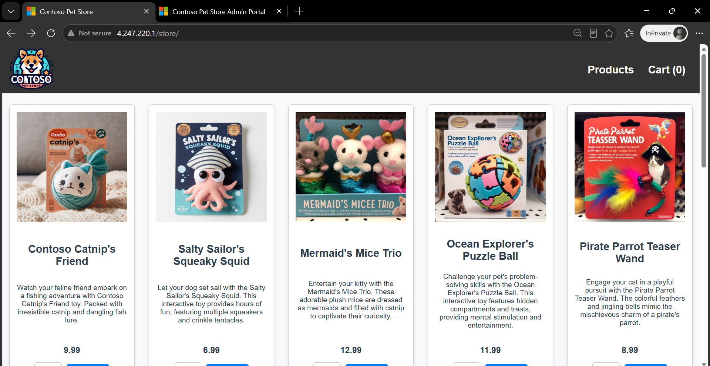
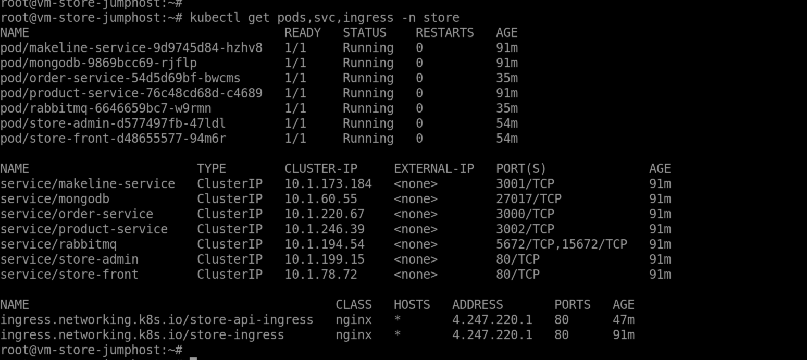
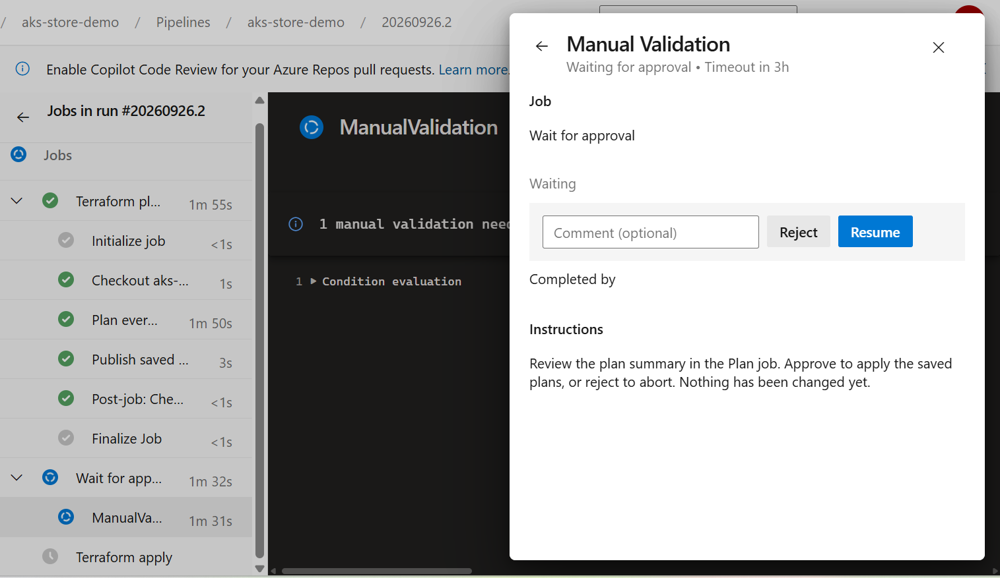
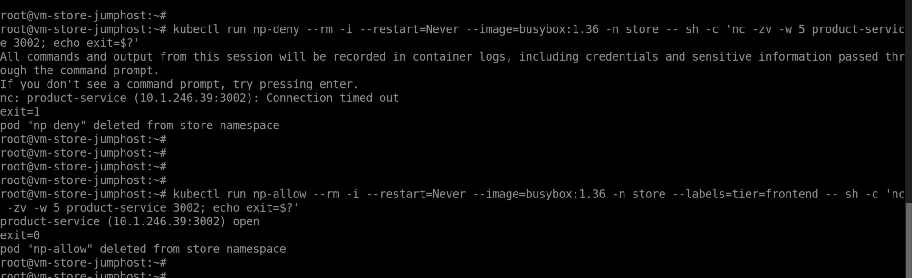

# Private AKS platform — Terraform, Azure Pipelines, Flux

A complete Azure platform built as infrastructure-as-code: three containerised applications
built and pushed by Azure DevOps pipelines, deployed to a **private** AKS cluster by Flux,
and served from a single public ingress IP.

Everything except the Azure DevOps organisation and the Terraform state backend is
provisioned by Terraform, applied from a pipeline behind a manual approval gate.

> The applications are Microsoft's [`Azure-Samples/aks-store-demo`](https://github.com/Azure-Samples/aks-store-demo)
> sample. This repository is the **platform** around them — the Terraform, the pipelines,
> the Kubernetes manifests and the GitOps configuration.

---

## Architecture

```
                         internet
                            │
                     one public IP  (Azure Load Balancer)
                            │
    ┌───────────────────────┼─────────────────────────────────────┐
    │ VNet 10.0.0.0/16      │                                     │
    │                 ┌─────▼──────┐                              │
    │                 │   nginx    │   snet-aks-node 10.0.1.0/24  │
    │                 │  ingress   │                              │
    │                 └──┬──────┬──┘                              │
    │            /store  │      │  /admin                         │
    │              ┌─────▼─┐  ┌─▼──────┐                          │
    │              │store- │  │ store- │   tier=frontend          │
    │              │front  │  │ admin  │                          │
    │              └───┬───┘  └───┬────┘                          │
    │                  │ proxies /api internally                  │
    │        ┌─────────┼──────────┼─────────┐                     │
    │   ┌────▼────┐ ┌──▼───────┐ ┌▼─────────┐  tier=backend       │
    │   │ order-  │ │ product- │ │ makeline-│  ← NetworkPolicy:   │
    │   │ service │ │ service  │ │ service  │    frontend only    │
    │   └────┬────┘ └──────────┘ └────┬─────┘                     │
    │        │                        │                           │
    │   ┌────▼─────┐             ┌────▼────┐                      │
    │   │ RabbitMQ │────────────▶│ MongoDB │                      │
    │   └──────────┘             └─────────┘                      │
    │                                                             │
    │  PostgreSQL Flexible Server    snet-postgres 10.0.3.0/24    │
    │    delegated subnet, no public access                       │
    │                                                             │
    │  Key Vault (private endpoint)  snet-pe 10.0.2.0/24          │
    │  Jump host — no public IP, NAT gateway for egress,          │
    │              runs the self-hosted Azure DevOps agent        │
    └─────────────────────────────────────────────────────────────┘
```

The ingress load balancer is the **only** public entry point. The AKS API server has no
public endpoint, PostgreSQL has no public endpoint, and the jump host has no public IP.

---

## Running



*The storefront at `http://<ingress-ip>/store` — catalogue, images and cart all served
through the one public IP. Getting a Vite SPA to work under a path prefix took three
separate fixes; see [Serving an SPA under a sub-path](#serving-an-spa-under-a-sub-path).*



*Seven pods Running in the `store` namespace and three Ingress objects sharing a single
external IP — run from the jump host, because the API server has no public endpoint.*

---

## What's in here

```
terraform/
  policy/      subscription-scope Azure Policy assignments
  network/     RG, VNet, subnets, NSG, private DNS zones
  platform/    ACR, Key Vault + private endpoint, private AKS
  postgres/    Flexible Server + database, secrets to Key Vault
  jumphost/    NAT gateway, VM with no public IP, SSH key to Key Vault
  bastion/     Bastion host (separate module — it is slow and nothing depends on it)

pipelines/
  store-front-pipeline.yml       \
  order-service-pipeline.yml      }  build and push to ACR
  store-admin-pipeline.yml       /
  nginx-ingress-pipeline.yml        ingress controller via Helm
  terraform-infra-pipeline.yml      plan → manual approval → apply
  flux-gitops-pipeline.yml          bootstrap and reconcile Flux

apps/store/                         reconciled by Flux
  7 Deployments + Services, 3 Ingress objects, 1 NetworkPolicy

clusters/aks-store/                 written by `flux bootstrap`
```

Each Terraform module has **its own state file** in the same blob container and reads the
others through `terraform_remote_state`.

---

## How the pieces fit

**Images** are built by three Azure DevOps pipelines and pushed to ACR, tagged with
`$(Build.BuildId)` — never `latest`, because Kubernetes cannot detect that a mutable tag
changed and the rollout would silently do nothing.

**Infrastructure** is applied by a pipeline in three jobs: `plan` saves each plan as a build
artifact, `approve` pauses on a manual validation gate, and `apply` applies **those saved
plans** rather than recomputing them. Nothing is auto-approved.



*The `approve` job holding the run. Applying a saved plan rather than recomputing one is
the point: what gets approved is exactly what gets applied.*

**Applications** are deployed by Flux. Every change — including every fix made while
building this — went through git. Nothing was applied with `kubectl`.

**The ingress** routes `/store` and `/admin` to the two frontends, plus `/api/*` to the
frontends' own nginx, which proxies internally to the backends. That last detail is what
makes the NetworkPolicy both enforceable and honest: the browser never contacts a backend
directly.

---

## Deploying this yourself

### Prerequisites

- An Azure subscription with **Owner** at subscription scope
- An Azure DevOps organisation and project
- Resource providers registered (this is asynchronous — do it first):

```bash
for ns in Microsoft.ContainerService Microsoft.ContainerRegistry \
          Microsoft.DBforPostgreSQL Microsoft.KeyVault Microsoft.Network \
          Microsoft.Storage Microsoft.Compute Microsoft.ManagedIdentity; do
  az provider register --namespace $ns
done
```

- **Check your public IP quota.** Trial subscriptions cap at three per region and AKS
  silently takes one for outbound SNAT, which leaves two: the NAT gateway and the ingress.

### 1. State backend (the one manual step)

Terraform cannot store state before somewhere exists to store it.

```bash
az group create -n rg-store-tfstate -l centralindia \
  --tags "Business Unit=Engineering" "Cost Center=CC-1001"

SA=sttfstate$RANDOM            # 3-24 chars, lowercase alphanumeric only
az storage account create -n $SA -g rg-store-tfstate \
  -l centralindia --sku Standard_LRS --tags ...

KEY=$(az storage account keys list -g rg-store-tfstate -n $SA --query '[0].value' -o tsv)
az storage container create -n tfstate --account-name $SA --account-key "$KEY"
```

Keep it in a **separate resource group** from the workload, so `terraform destroy` can never
delete the state it is reading from.

### 2. Service principal

```bash
az ad sp create-for-rbac --name sp-store-devops \
  --role Owner --scopes "/subscriptions/<sub-id>"
```

**Owner is required, not laziness.** Contributor excludes `Microsoft.Authorization/*`, which
blocks both the policy assignments and the `AcrPull` / `AcrPush` / Key Vault role assignments.
The least-privilege equivalent is `Contributor` + `User Access Administrator` +
`Resource Policy Contributor`.

### 3. Values to change

| Where | Placeholder | Replace with |
|---|---|---|
| every `terraform/*/main.tf` backend block | `sttfstateexample` | your storage account |
| `pipelines/*-pipeline.yml` | `acrstoreexample` | your ACR name (from `terraform output`) |
| `pipelines/*.yml` | `YOUR-ADO-ORG` | your Azure DevOps organisation |
| `pipelines/terraform-infra-pipeline.yml` | `you@example.com` | approval notification address |
| `apps/store/*.yaml` | image tags | the tags your builds produced |

### 4. Apply in dependency order

```
policy → network → platform → postgres → jumphost → bastion
```

`terraform_remote_state` reads a module's **state file**, so a module must be applied before
anything that reads it. Terraform cannot enforce this across directories — the ordering is
your discipline.

**Apply `policy` first, deliberately.** Policy assignments evaluate at write time, not
retroactively, so applying them first means everything afterwards is forced to comply.

### 5. The rest

1. Create an agent pool, install the agent on the jump host, create an ARM service
   connection using **App registration (manual)** with the same service principal
2. Register and run the three build pipelines
3. Run the ingress pipeline, note the public IP
4. Update the image tags and IP in `apps/store/`, commit
5. Run the Flux pipeline

---

## Design decisions

**The cluster is private**, which forces everything else. A Microsoft-hosted agent can
authenticate to it perfectly and still fail — there is nowhere to send the packet.
Credentials and connectivity are separate problems. Hence a jump host inside the VNet
running a self-hosted agent.

**ACR's admin account is disabled.** There is no shared username/password; the AKS kubelet
identity pulls and the pipeline's service principal pushes, each individually revocable and
distinguishable in logs. That is also why the build pipelines use `AzureCLI@2` and
`az acr login` rather than the `Docker@2` task.

**Key Vault uses RBAC, not access policies.** The consequence is that *creating* the vault
grants no data access — reading a secret needs a separate role assignment. That is the same
control-plane / data-plane split that makes a storage container need `--account-key` even
when you are subscription Owner.

**`network_policy = "calico"`** is load-bearing. Without a policy engine, NetworkPolicy
objects are accepted and **silently ignored**.



*Proving the policy is enforced rather than merely present: two otherwise identical pods
differing only by the `tier=frontend` label. One reaches `order-service`, the other times
out. Without Calico, both would succeed.*

**`kubenet`, not Azure CNI.** Nothing needs pods individually addressable from the VNet, and
Azure CNI assigns an IP per pod — a `/24` would be exhausted at two nodes.

**The jump host has no public IP** (policy forbids it), so it egresses through a NAT gateway.
Azure retired default outbound access, so without one the agent could never reach
`dev.azure.com`.

**Bastion lives in its own module** because it takes 10–45 minutes and nothing depends on it.
Putting it on the critical path costs a quarter of an hour for nothing.

---

## Things that are not obvious

Collected because each one cost real time, and none of them produce a useful error.

### The load balancer health probe

AKS sets `EnableFloatingIP=True`, so the load balancer **does not rewrite the destination
port**: real traffic arrives at the node on **80** while the health probe arrives on the
**NodePort**. An NSG allowing only `30000-32767` therefore lets probes pass — so the LB
reports the backend healthy — while silently dropping every real request.

Separately, nginx serves `/healthz` on port **10254**, not on 80. Probing `/healthz` or `/`
returns 404, the node is marked unhealthy, and everything is dropped while a direct NodePort
curl still returns 200.

> **A passing health check proves the health-check path, not the data path.**

### AKS has two identities

`AcrPull` belongs on the **kubelet** identity, not the cluster identity. The cluster identity
manages load balancers and routes; the kubelet pulls images. Getting it wrong gives
`ImagePullBackOff` with a role assignment that looks perfectly correct in the portal.

### Cluster tags do not reach the node pool

AKS creates its own resource group (`MC_<rg>_<cluster>_<region>`) for the VMSS, load balancer
and node NICs. Cluster-level `tags` do not propagate there, so a mandatory-tag policy rejects
the VMSS. The node pool needs its own `tags` block.

### Serving an SPA under a sub-path

Three separate failures, one root cause — the app emits **root-relative URLs** while being
served from a prefix:

| Symptom | Fix |
|---|---|
| blank page, JS/CSS 404 | build-time base path (`vite build --base=/store/`) |
| API calls 404 | an Ingress rule for `/api` with **no** rewrite — the in-pod nginx proxies it and needs the path intact |
| broken images | an Ingress rule for root-level files, **with** a rewrite |

And a trap inside the first: if `package.json` has
`"build": "run-p type-check \"build-only {@}\" --"`, then `npm run build -- --base=/x/`
hands the flag to `run-p`, not Vite. The build succeeds and silently ignores it.

### Kustomize ignores what you do not list

`kustomization.yaml` must name **every** file in `resources:`. Anything unlisted is silently
skipped, and Flux then reports success while the objects never existed.

### Private DNS zones answer for nobody until linked

A zone plus the right A record is not enough — it needs a **virtual network link** to the VNet
doing the asking. Without it the client falls through to public DNS and times out, with no
error anywhere.

### Terraform's silent identity fallback

If `ARM_CLIENT_ID` is unset, the azurerm provider does not error — it quietly uses your
`az login` session. The symptom is not an auth failure; it is role assignments recorded with
`principal_type = "User"` and later 403s that make no sense.

> The pattern across all of these: **every expensive failure reported success.** The probe
> passed on a different path, `sed` matched nothing and exited 0, the build ignored a flag,
> Kustomize skipped a file. Silent success is the failure mode to design against — which is
> why every patch step in these pipelines ends with a `grep` that proves it landed.

---

## Not included

- **`ai-service`** from the upstream sample — it requires an OpenAI endpoint
- **A PostgreSQL client.** The server and database are deployed and private, but the
  `aks-store-demo` services use RabbitMQ and MongoDB by design and have no PostgreSQL
  backend. Those run in-cluster so the applications function end to end
- **ACR private endpoint** — that requires the Premium tier; this uses Basic. Image pulls
  authenticate with the AKS kubelet managed identity over TLS, with no shared credential
- **TLS on the ingress** — plain HTTP only. Production would terminate TLS with
  cert-manager or Application Gateway

## Licence

The platform code here is free to reuse. The applications it deploys belong to
[Azure-Samples/aks-store-demo](https://github.com/Azure-Samples/aks-store-demo) under its
own licence.
